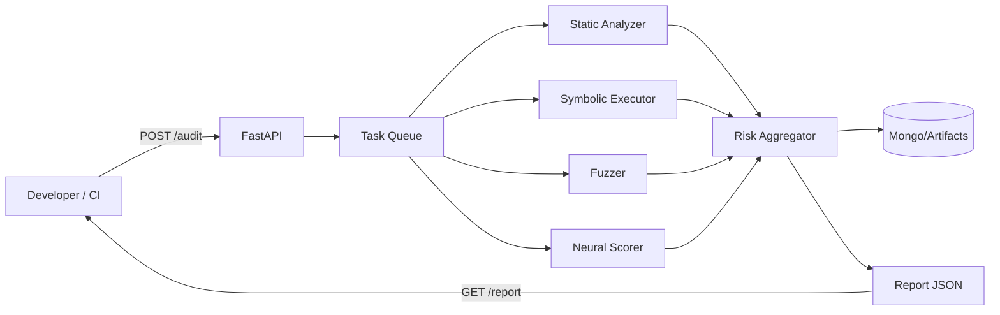

```mermaid
flowchart LR
  user[Developer / CI] -->|POST /audit| API[FastAPI]
  API --> Q[Task Queue]
  Q --> SA[Static Analyzer]
  Q --> SE[Symbolic Executor]
  Q --> FZ[Fuzzer]
  Q --> NN[Neural Scorer]
  SA --> RS[Risk Aggregator]
  SE --> RS
  FZ --> RS
  NN --> RS
  RS --> DB[(Mongo/Artifacts)]
  RS --> REP[Report JSON]
  REP -->|GET /report| user
```
