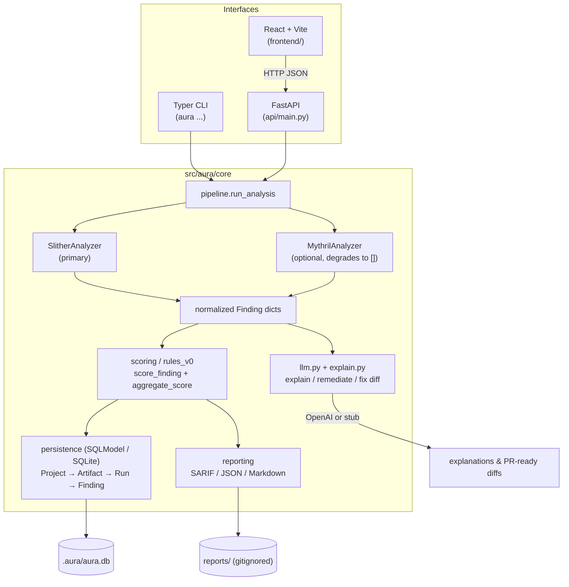

# AURA — Architecture

AURA is a Solidity smart-contract security tool: **detect → explain → fix**.
Everything routes through an interface-agnostic core pipeline; the CLI, the
FastAPI service, and the React frontend are all thin consumers of it.

> This document describes the system **as built**. (An earlier version of this
> file described a Mongo / task-queue / fuzzer / neural-scorer design that was
> never implemented — that has been removed.)

## Data flow

## Components

| Layer | Location | Responsibility |
|-------|----------|----------------|
| CLI | `src/aura/cli.py` | Primary surface: `analyze`, `explain`, `explain-llm`, `fix`, `eval`, `benchmark`, `llm` |
| API | `api/main.py` | FastAPI: `/health`, `/analyze`, `/explain`, `/explain-llm`, async `/audit` + `/report/{id}` |
| Frontend | `frontend/` | React + Vite + TS UI (Dashboard, Analyze, Explain, History) |
| Pipeline | `core/pipeline.py` | Orchestrates detect → score → persist → report |
| Analyzers | `core/analyzers/` | `slither_adapter` (primary), `mythril_adapter` (optional); normalize to `Finding` |
| Scoring | `core/scoring/` | Per-finding score + aggregate risk score |
| Reporting | `core/reporting/` | SARIF, JSON, Markdown emitters |
| Persistence | `core/persistence/` | SQLModel models + CRUD over SQLite (`.aura/aura.db`) |
| LLM | `core/llm.py`, `core/explain.py` | Explanation / remediation prompts; OpenAI or deterministic stub |
| Evaluation | `core/evaluation/` | Precision / recall / F1 vs a golden SARIF baseline (CI guard) |

## Persistence model

`Project` → has many `Artifact` → has many `Run` → has many `Finding`.
Findings store normalized fields plus a `data` JSON blob. SQLite file lives at
`${AURA_DB_DIR:-.aura}/aura.db`.

## Configuration

| Variable | Used by | Default | Purpose |
|----------|---------|---------|---------|
| `OPENAI_API_KEY` | `core/llm.py` | _(unset → stub)_ | Enables real LLM output |
| `AURA_DB_DIR` | `core/persistence/db.py` | `.aura` | SQLite base directory |
| `VITE_API_BASE_URL` | `frontend/` (build) | `/api` | Backend URL for the React app |

## External prerequisites

`solc` on PATH (installed via `solc-select` in CI), Slither, and optionally
Mythril (`myth`). Missing analyzers degrade gracefully rather than crashing the
pipeline.

## Known gaps

- The async `/audit` endpoint stores jobs in an in-memory `FAKE_DB`, **not** the
  SQLModel store — audit history is not durable (see `docs/phases/phase-5.md`).
- No backend is currently deployed; `render.yaml` ships only the static frontend
  to a placeholder URL, and the UI's paste mode has no upload path (P5).
